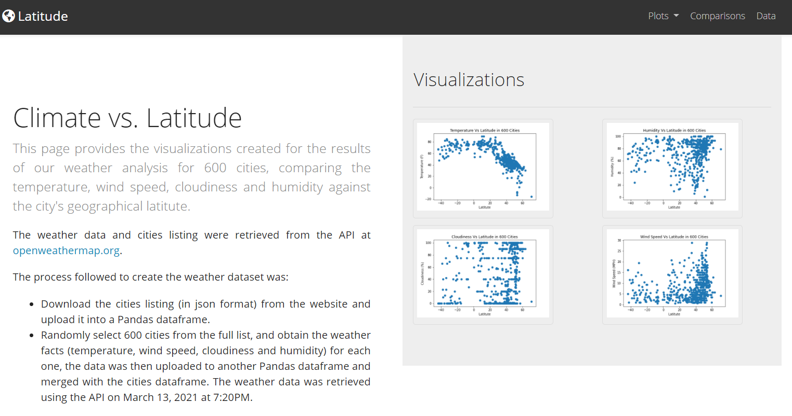
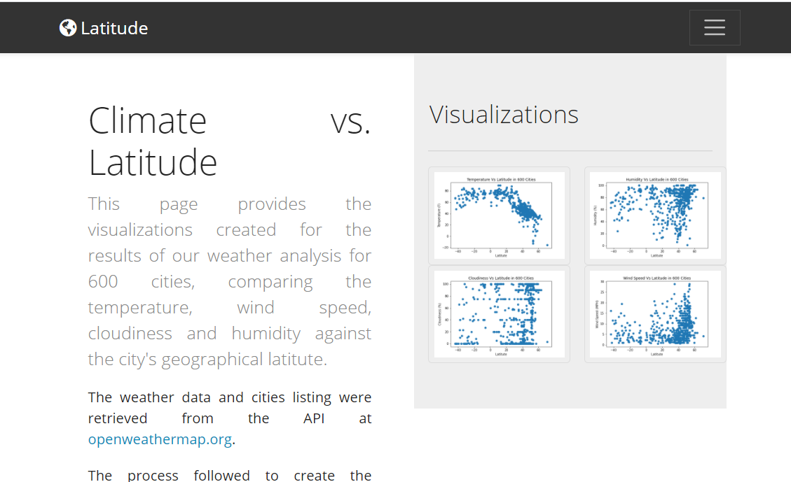
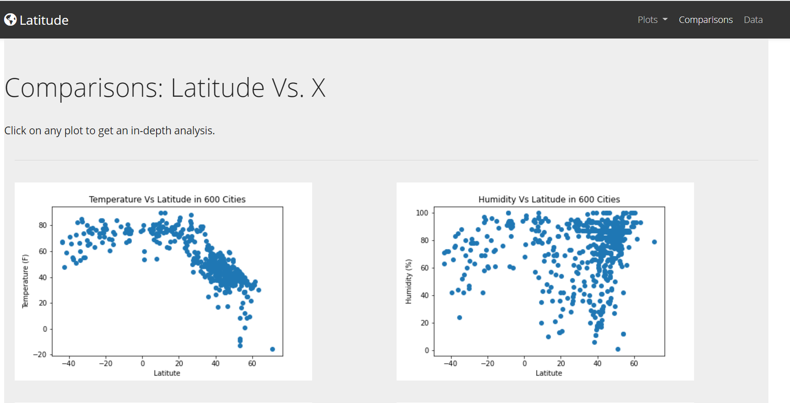
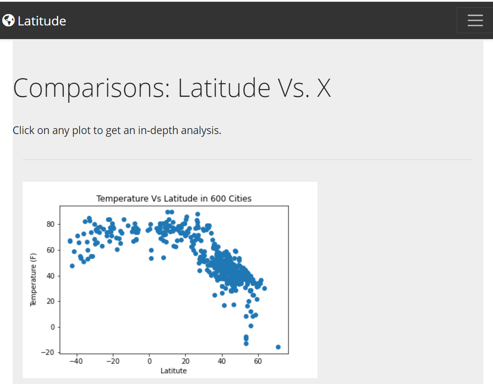
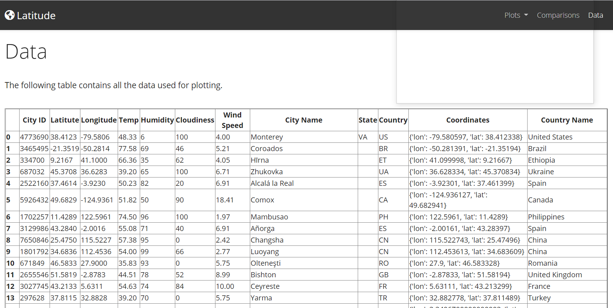
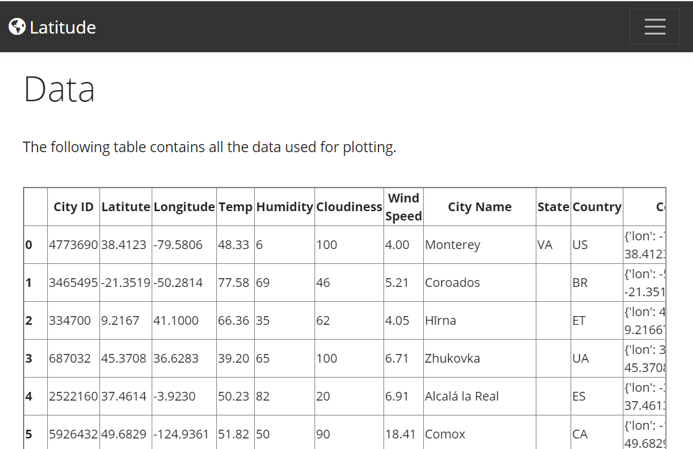
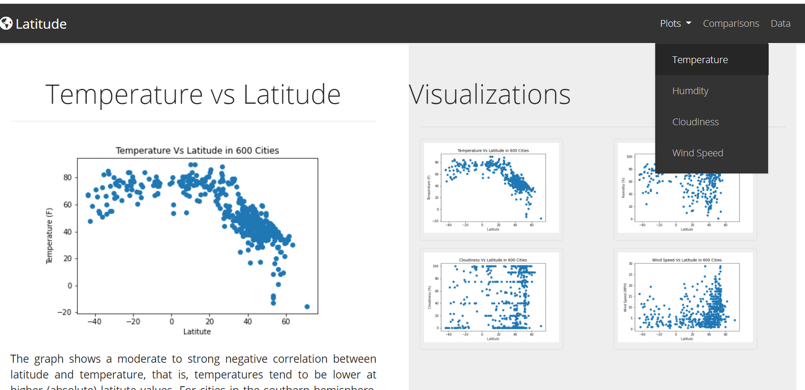
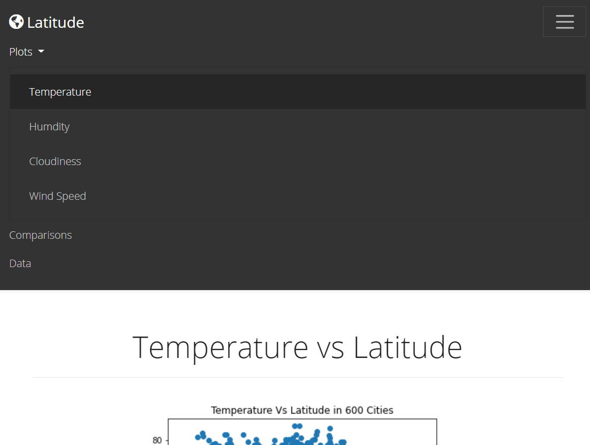
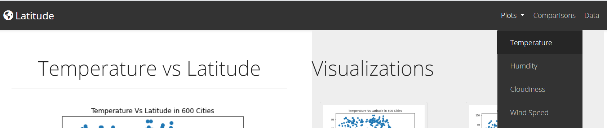
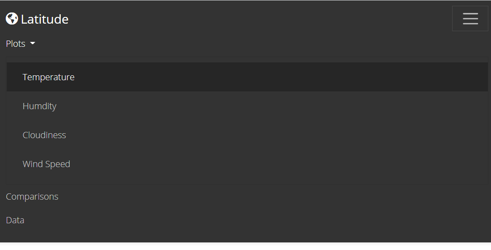

# Web Design Homework 11 - Web Visualization Dashboard (Latitude)

## Background

Data is more powerful when we share it with others! Let's take what we've learned about HTML and CSS to create a dashboard showing off the analysis we've done.

## Latitude - Latitude Analysis Dashboard with Attitude

For this homework, we created a visualization dashboard website using visualizations from a past assignment. Specifically, we plotted weather data that was analyzed in homework 6 - Python APIs.

In building this dashboard, we created individual pages for each plot and a means by which we can navigate between them. These pages contain the visualizations and their corresponding explanations. We also have a landing page, a page where we can see a comparison of all of the plots, and another page where we can view the data used to build them.

### Website Contents

The website consists of 7 pages total, including:

* A [landing page](#landing-page) containing:
  * An explanation of the project.
  * Links to each visualizations page, with a sidebar containing preview images of each plot, where clicking an image takes the user to that visualization.
* Four [visualization pages](#visualization-pages), each with:
  * A descriptive title and heading tag.
  * The plot/visualization itself for the selected comparison.
  * A paragraph describing the plot and its significance.
* A ["Comparisons" page](#comparisons-page) that:
  * Contains all of the visualizations on the same page so we can easily visually compare them.
* A ["Data" page](#data-page) that:
  * Displays a responsive table containing the data used in the visualizations.
    * The data came from exporting the `.csv` file as HTML, using Panda's `to_html` method.
    
    The website has, at the top of every page, a navigation menu that:

* Has the name of the site on the left of the nav which allows users to return to the landing page from any page.
* Contains a dropdown menu on the right of the navbar named "Plots" that provides a link to each individual visualization page.
* Provides two more text links on the right: "Comparisons," which links to the comparisons page, and "Data," which links to the data page.
* Is responsive.

# Deployment

The website has been deployed to [GitHub Pages](https://j0serobles.github.io/Web-Design-Challenge/index.html)

### Screenshots

This section contains screenshots of each page that was built, at varying screen widths.

#### Landing page

Large screen:

Small screen:



#### Comparisons page

Large screen:

Small screen:

#### Data page

Large screen:

Small screen:

#### Visualization pages

We built four of these, one for each visualization. Here's an example of one:

Large screen:

Small screen:

#### Navigation menu

Large screen:

Small screen:

